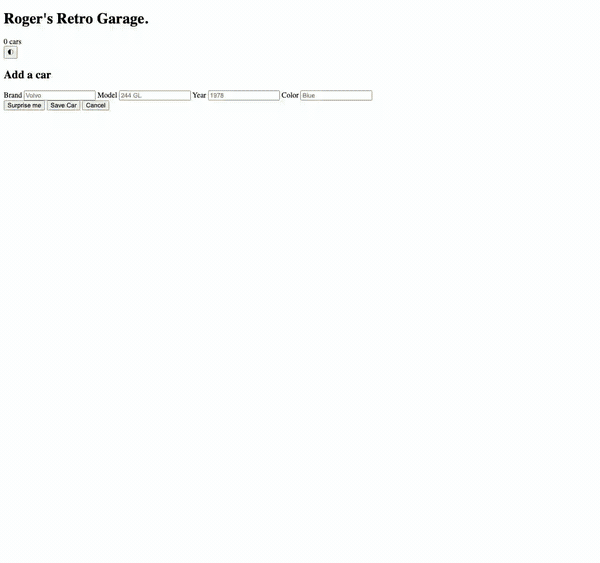

# Roger's Retro Cars — Frontend (TypeScript)



A full-CRUD single-page app for managing a collection of classic cars, built in
**TypeScript** with **Vite**. This is the frontend half of the exercise; it talks
to the [C# Minimal API backend](../api) over `fetch`.

## About

This is the TypeScript solution to **Lexicon Övning 8 — _Cars med Typescript_**
(LTU 2026), presented as the **MVP + Beyond** lecture. The same Cars CRUD app is
built once in TypeScript against an unchanged C# Minimal API, growing through the
handout's three tasks:

| Level | Task        | Verb     | What it teaches                                    |
| ----- | ----------- | -------- | -------------------------------------------------- |
| 1     | Create a car| `POST`   | Typed `fetch`, reading a form via DOM casting      |
| 2     | Delete a car| `DELETE` | Event wiring without inline `onclick`, module scope|
| 3     | Edit a car  | `PUT`    | A typed `number \| null` edit-state, POST-or-PUT branch |

## Stack

- **TypeScript** — the whole point of the exercise
- **Vite** — dev server and build tool
- **[Tailwind CSS](https://tailwindcss.com/) v4** — via the Vite plugin, configured in CSS with OKLCH design tokens
- **[Vitest](https://vitest.dev/)** — unit tests for the pure functions, plus one API contract test
- **pnpm** — package manager
- Plain `fetch` against the backend — no framework, no client library

## Getting started

**Prerequisites:** Node.js, [pnpm](https://pnpm.io/) (via `corepack enable pnpm`),
and the [backend API](../api) running.

```bash
# 1. Start the backend first (see ../api) — it serves http://localhost:5227/api/cars

# 2. Install dependencies
pnpm install

# 3. Point the app at your API
cp .env.example .env      # then edit VITE_API_URL if your backend differs

# 4. Run the dev server
pnpm dev                  # → http://localhost:5173
```

Other scripts:

```bash
pnpm build     # type-check with tsc, then bundle with Vite into dist/
pnpm preview   # serve the production build locally
pnpm test      # run the Vitest suite once
```

## Project layout

```
web/
├── index.html        Entry point — carries the page markup; only #car-list is rendered from TS
└── src/
    ├── main.ts             Wires up form + list event listeners on load; holds the edit/confirm state
    ├── api.ts              getCars / createCar / updateCar / deleteCar
    ├── types.ts            interface ICar
    ├── render.ts           DOM layer: escapeHtml, buildCarCard, renderCars
    ├── validate.ts         Pure validateCar → CarErrors, shared by form and tests
    ├── toast.ts            showToast — transient "good" / dismissible "bad" notifications
    ├── catalog.ts          Retro car list behind the "Surprise me" random generator
    ├── style.css           Tailwind import, OKLCH design tokens, dark theme
    ├── cars.fixture.json   Captured GET /api/cars response, used by the contract test
    ├── validate.test.ts    Unit tests for validateCar
    ├── render.test.ts      Unit tests for escapeHtml / buildCarCard
    └── contract.test.ts    Pins the API response shape to ICar
```

## Robustness

The app is deliberately hardened past "it works on the happy path":

**Output escaping.** Cards are built as HTML strings and assigned via
`innerHTML`, so every interpolated value goes through `escapeHtml` first. Without
it, a car saved with a `<script>`-shaped brand would execute on every later page
load — a stored XSS hole. `escapeHtml` takes `unknown` and stringifies, so
numeric fields like `id` and `year` are covered by the same gate.

**Two-sided validation.** `validateCar` is a pure function — no DOM, no fetch —
that maps an `ICar` to a `CarErrors` object. The submit handler runs it before
any request, marks each offending input with a `.bad` class, and shows the first
message as a toast. Being pure is what makes it directly unit-testable. The
[API validates independently](../api#validation-and-errors); the client checks
are for fast, friendly feedback, never the security boundary.

**Guarded delete.** Deleting is two-step rather than immediate: the delete button
flips the card into a confirm state (`confirmingId`), which re-renders it with
_Cancel_ / _Delete_. `Escape` backs out. No `window.confirm`, so the guard stays
inside the app's own visual language.

**Toasts, not silence.** Every fetch is wrapped, and both outcomes speak:
successes as auto-dismissing "good" toasts (4s), failures as "bad" toasts that
persist until dismissed — an error you miss is worse than one you must click
away. The two live in separate regions (`#toast-status`, `#toast-alert`) so
screen readers announce them with the right urgency.

**Narrow test coverage.** The suite covers the pure functions (`validateCar`,
`escapeHtml`, `buildCarCard`) plus one contract test that pins the backend's
response shape to `ICar` from a captured fixture — so a backend that starts
returning `PascalCase` fails a test instead of silently rendering blank cards.
Wiring and DOM event plumbing are left untested on purpose.

```bash
pnpm test
```
